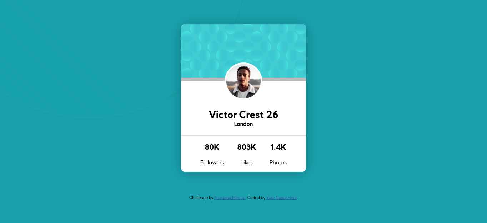

# Frontend Mentor - Profile card component solution

This is a solution to the [Profile card component challenge on Frontend Mentor](https://www.frontendmentor.io/challenges/profile-card-component-cfArpWshJ). Frontend Mentor challenges help you improve your coding skills by building realistic projects. 

## Table of contents

- [Overview](#overview)
  - [The challenge](#the-challenge)
  - [Screenshot](#screenshot)
  - [Links](#links)
- [My process](#my-process)
  - [Built with](#built-with)
  - [What I learned](#what-i-learned)
  - [Continued development](#continued-development)
- [Author](#author)

### The challenge

- Build out the project to the designs provided

### Screenshot



### Links

- Live Site URL: [Add live site URL here](https://your-live-site-url.com)

## My process

### Built with

- Semantic HTML5 markup
- CSS custom properties
- CSS Grid


### What I learned

Use this section to recap over some of your major learnings while working through this project. Writing these out and providing code samples of areas you want to highlight is a great way to reinforce your own knowledge.

To see how you can add code snippets, see below:


```css
.add-drop-shadow {
  filter:drop-shadow(3px 3px 1px #3335);
}
```

### Continued development

Learning gap noted css positioning with absolute properties.


## Author

- Frontend Mentor - [@codeplayer12](https://www.frontendmentor.io/profile/codeplayer12)
- Twitter - [@noblethunder](https://www.twitter.com/noblethunder)

